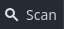

<h1>
  GDQuest Challenge: SHMUPS
</h1>
This repository serves as a practice project for learning <a href="https://godotengine.org">Godot Engine</a>, following the <a href="https://www.gdquest.com">GDQuest</a> course. It is intended purely for educational purposes and has no plans for further development. Please note that this repository is not affiliated with GDQuest.
<h2>
  Features
</h2>
<li>
  Interactive Start Menu
</li>

<li>
  Responsive Health Bars
</li>

<li>
  Lives System
</li>

<li>
  Invincibility Frames
</li>

<li>
  Highscore Updates
</li>

<li>
  Game Over Animation
</li>

<h2>
  Downloading the Project File
</h2>
To import the demo into the project manager:
 
 
<li>
  Clone this repository (or
  <a href="https://github.com/guacboy/gdquest-challenge-shmups/archive/refs/heads/main.zip">
    download</a>
  a ZIP archive)
</li>
<ul>
  <ul>
    <li>
      <code>git clone https://github.com/guacboy/gdquest-challenge-shmups</code>
    </li>
  </ul>
</ul>
<li>
  Open Godot's project manager and click the
  
  button on the top-left.
</li>
<li>
  Select the path to the folder containing the project files.
</li>
 
and voilà! Project should now appear in the project manager.
<h2>
  License and Assets
</h2>
This demo is distributed under the terms of the MIT license, as described in the <a href="https://github.com/guacboy/gdquest-challenge-shmups/blob/main/LICENSE">LICENSE.md</a> file. The asset(s) used for this demo are not mine and can be found in the link(s) below:
<li>
  https://jfaexe.itch.io/simple-pixel-spaceships
</li>
<li>
  https://tokka.itch.io/pixel-explosion-basic-set
</li>
<li>
  https://arcadeisland.itch.io/space-shooter-wang-tiles
</li>
<li>
  https://levivb.itch.io/heavy-8bit-explosions-sounds
</li>
<li>
  https://deep-fold.itch.io/space-background-generator
</li>
<li>
  https://joebrogers.itch.io/bitpotion
</li>
